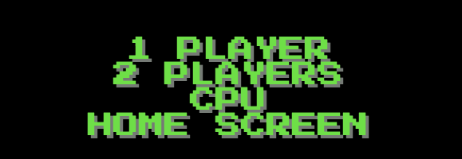
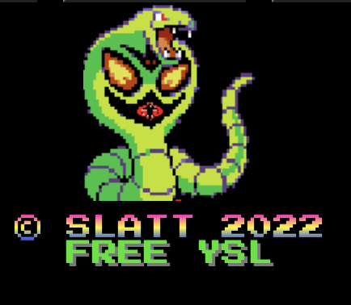

# PROJECT 2 

[Project 2](https://bibi78.github.io/DiceGame/)

# Features 

This is classic American dice game played on the streets of New York City. 

1. Options 
* This game is up to two players or you can play against the CPU 

2. Styling 
* I styled the game in the 1980s 2-bit gaming fashion and tried to give a genuine 80s arcade game feel.
* I found the 2-bit font ("2-Player" in google fonts) first and that slowly inspired the rest of the project.
things kind of fell into place.

* The color way is supposed to invoke snakes and the like to give the game a street/ unfair look, like you playing dice with a snake.

# Testing 
*The testing was difficult. I had a lot of bugs in my javascript I couldnt figure out. Actually I spent about five days on a problem with the "Spin" fucntion I created.
